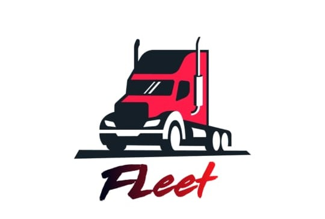

    

# Fleet

  

##  Objetivos de Fleet

Brindar soporte a las empresas de logística, para el manejo de flotas. Permitiendo a partir de un rol de administrador, mejorar el tiempo y la asignación de recursos a los trasportistas de una misma flota.

## Funcionalidades principales

- [ ] Rol administrador

- Completar perfil.
- Agregar transportistas.
- Agregar diferentes viajes.
- Ver estados de los transportistas (fuera de servicio, disponible, viaje en curso).
- Ver historial de viajes finalizados de los diferentes transportistas.
- Pago del saldo a los trasportistas.
- Comunicación con los transportistas por chat.

- [ ] Rol transportistas

- Completar perfil.
- Completar datos del vehículo.
- Cargar método de pago.
- Seleccionar un viaje.
- Historial de viajes.
- Ver saldo acumulado.
- Finalizar viaje.

## Tecnologías usadas:

- [ ] React Native.
- [ ] Redux.
- [ ] Express.
- [ ] Sequelize - PostgresSQL
- [ ] Socket.io
- [ ] TypeScript 

## Video Presentacion

